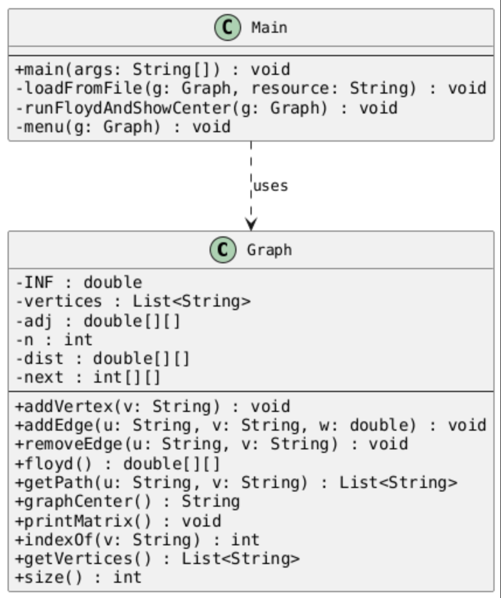

# HT10 – Grafos con Floyd-Warshall

**CC2003 – Algoritmos y Estructura de Datos | UVG | Semestre I 2020**

Sistema de rutas óptimas para el Centro de Respuesta COVID-19 de Guatemala. Modela la red vial nacional como un grafo dirigido ponderado y calcula caminos mínimos entre cualquier par de ciudades usando Floyd-Warshall.

---

## Requisitos

- Java 21+
- Maven 3.6+

---

## Compilar

```bash
mvn compile
```

## Ejecutar

```bash
mvn exec:java
```

El programa carga `guategrafo.txt`, imprime la matriz de adyacencia y el centro del grafo, luego muestra un menú interactivo.

## Pruebas

```bash
mvn test
```

15 pruebas unitarias con JUnit 5 cubriendo `addVertex`, `addEdge`, `removeEdge`, `floyd()`, `getPath()` y `graphCenter()`.

---

## Estructura del proyecto

```
src/
  main/
    java/uvg/edu/gt/
      Graph.java      # Grafo dirigido + Floyd-Warshall + centro
      Main.java       # Carga de archivo + menú interactivo
    resources/
      guategrafo.txt  # Red vial de Guatemala (15 ciudades, 5 regiones)
  test/
    java/uvg/edu/gt/
      GraphTest.java  # Pruebas JUnit 5
docs/
  uml.puml            # Fuente PlantUML del diagrama de clases
  diagrama-uml.png    # Diagrama de clases renderizado
networkx_floyd.py     # Implementación opcional con NetworkX (Python)
```

---

## Clases

### `Graph`

Grafo dirigido ponderado con matriz de adyacencia dinámica.

| Método | Descripción |
|--------|-------------|
| `addVertex(v)` | Agrega vértice; ignora duplicados |
| `addEdge(u, v, w)` | Agrega/sobrescribe arco dirigido u→v con peso w |
| `removeEdge(u, v)` | Elimina arco (cordón sanitario / derrumbe) |
| `floyd()` | Ejecuta Floyd-Warshall; retorna matriz APSP |
| `getPath(u, v)` | Reconstruye ruta usando matriz de predecesores |
| `graphCenter()` | Devuelve el vértice con mínima excentricidad |
| `printMatrix()` | Imprime matriz de adyacencia formateada |

**Complejidad:** Floyd O(n³) · Consulta de ruta O(n) · Agregar/eliminar arco O(1)

### `Main`

Punto de entrada. Lee `guategrafo.txt` del classpath y expone el menú:

1. Consultar ruta más corta (origen → destino, km + ciudades intermedias)
2. Mostrar centro del grafo
3. Modificar grafo (eliminar o agregar arco; recalcula Floyd automáticamente)
4. Salir

---

## Teoría: Centro del Grafo

1. Aplicar Floyd → matriz APSP `dist[i][j]`
2. **Excentricidad(v)** = max de la columna `v` en `dist` = peor distancia desde cualquier origen hacia `v`
3. **Centro** = vértice con mínima excentricidad

---

## Implementación opcional – NetworkX (Python)

Requiere Python 3.10+ y NetworkX:

```bash
pip install networkx
python3 networkx_floyd.py
```

Replica las mismas funcionalidades del programa Java: carga `guategrafo.txt`, imprime la matriz APSP completa, calcula el centro del grafo y expone el mismo menú interactivo.

---

## Diagrama UML



Fuente PlantUML: [`docs/uml.puml`](docs/uml.puml)
